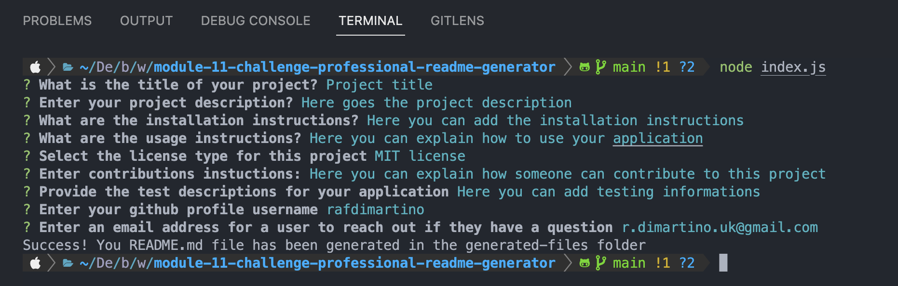

# Working with ES6 & Node.js: Professional README Generator
## Description

In this challenge I created a command-line application that dynamically generates a professional README.md file from a user's input using the [Inquirer.js](https://www.npmjs.com/package/inquirer) package, the application is built in node.js and uses ES6 sintax.

## Table of content
* [Installation](#installation)
* [Usage](#usage)
* [Contributing](#contributing)
* [License](#license)

## Installation
Clone the repo to your machine and open a terminal of your choice navigate to the root of the newly cloned folder and run `npm install` in the terminal. You are all set now to run the program.

## Usage
After the installation instructions, in the terminal, run `node index.js`, you will prompted with some question to answer, your answers will be the content of the readme.md.
At the end of the program, your file will be generated in the `generated-files` folder.

This is a demo of the application: [video walkthrough](https://drive.google.com/file/d/1I6WU9V-MWEoTB9aqpmu127aNW5MqWc4L/view?usp=sharing).

The following image shows the application's appearance and functionalities:

Here is an example of generated [README.md](https://github.com/RafDiMartino/module-11-challenge-professional-readme-generator/tree/main/generated-files).

## Contributing
To contribute to this project please contact me via email: <r.dimartino.uk@gmail.com>.

## License

This software is distributed under the MIT-licence

